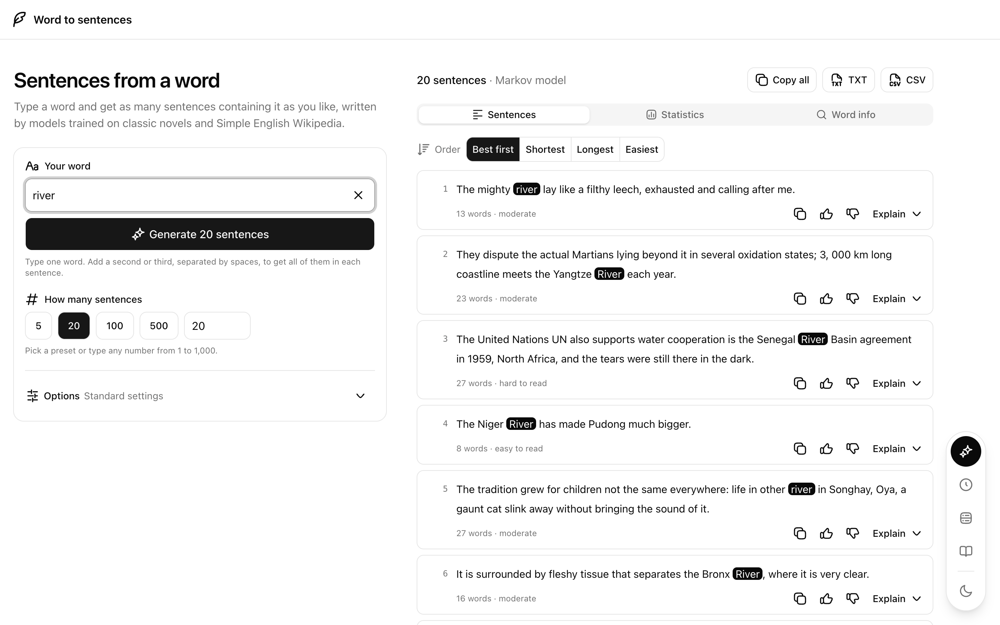
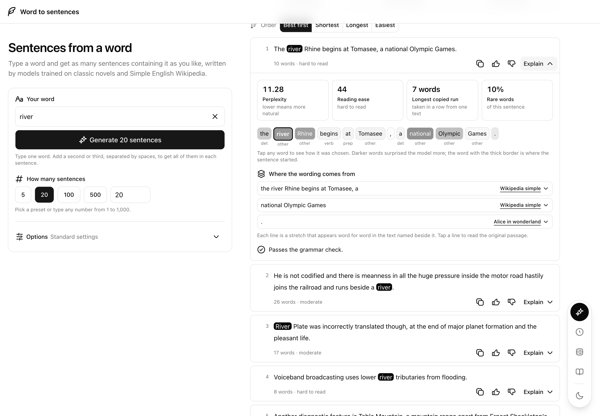
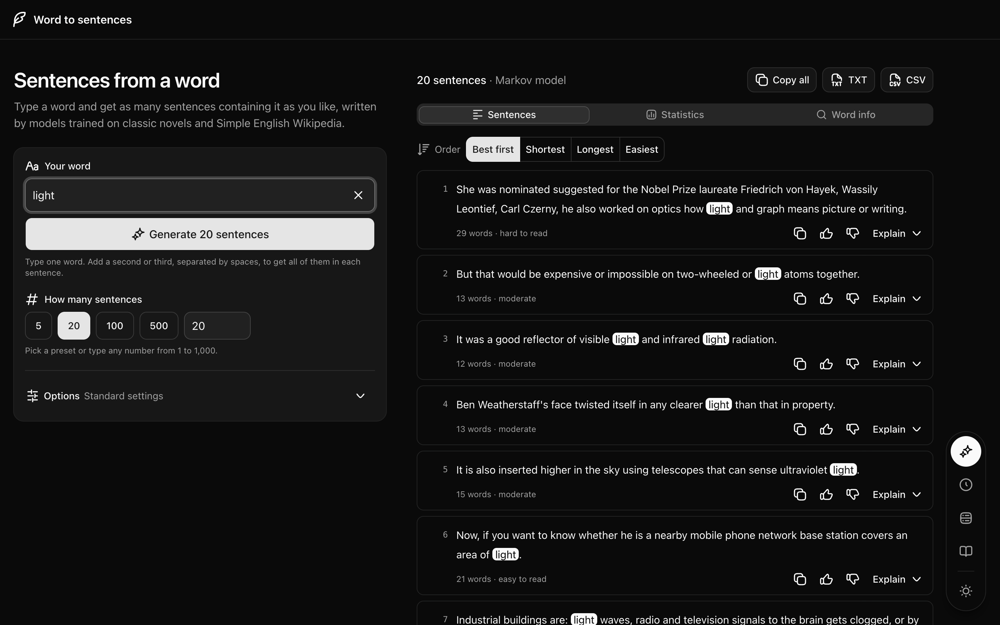
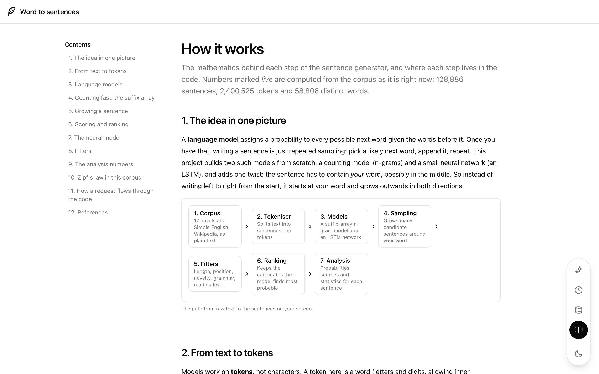
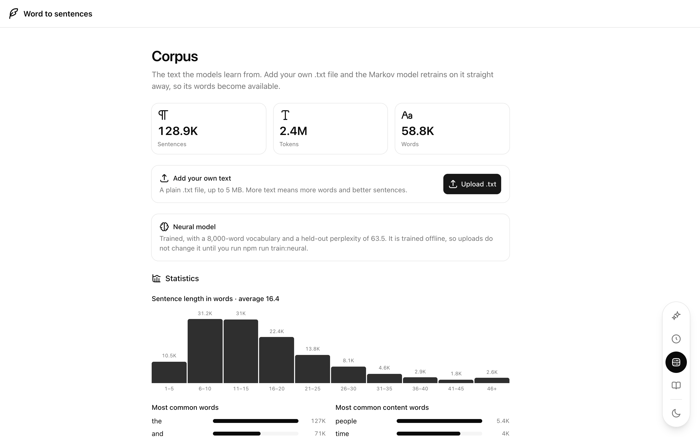
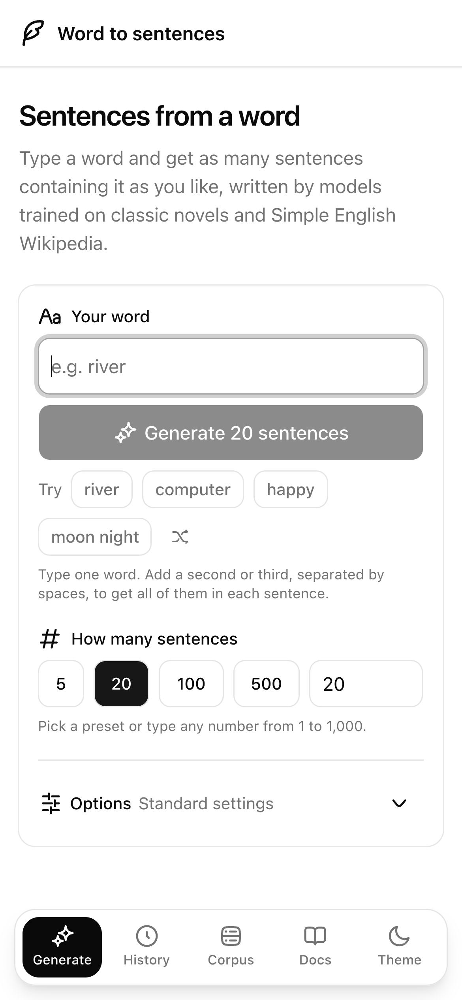
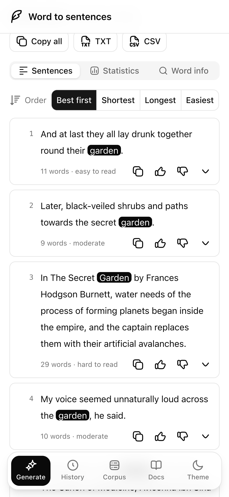
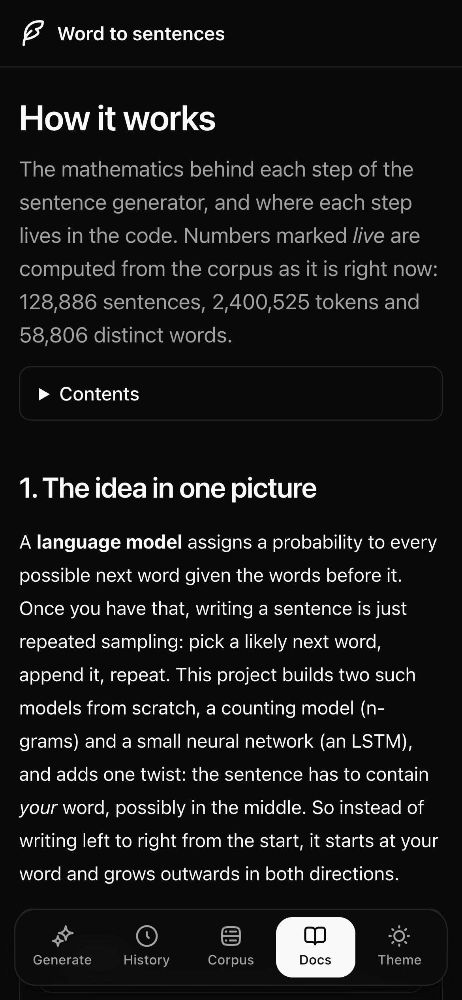

# wordseed

Type a word, get as many sentences as you want. Two language models built from scratch, an n-gram model on a suffix array and a small LSTM, grow sentences around your word, then rank, filter and explain every one of them mathematically.

**[Try it live → wordseed-five.vercel.app](https://wordseed-five.vercel.app)**

## Screenshots

<table>
  <tr>
    <td></td>
    <td></td>
  </tr>
  <tr>
    <td></td>
    <td></td>
  </tr>
</table>

<table>
  <tr>
    <td></td>
    <td></td>
    <td></td>
  </tr>
</table>
